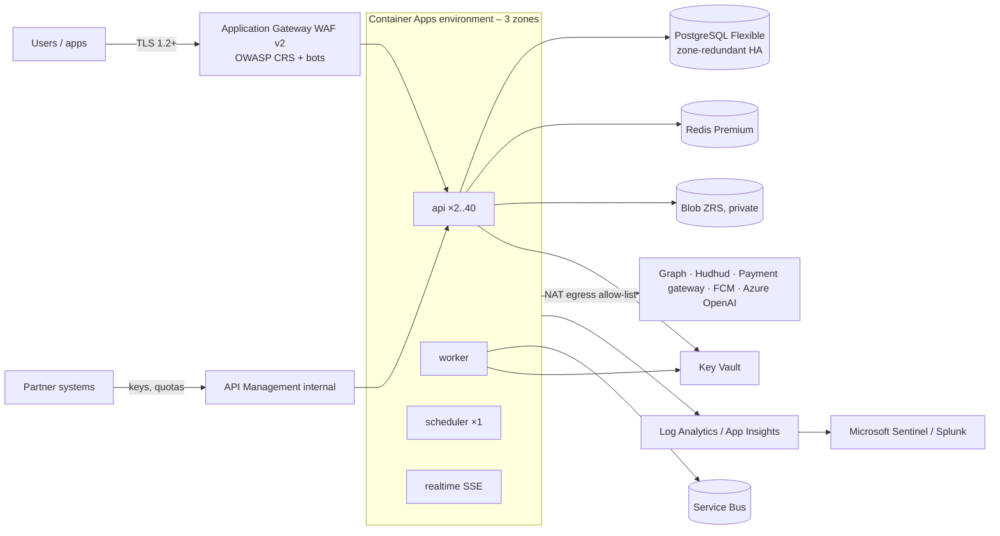

# High-level design — TEDC on Azure Qatar Central

**ملخص:** تعمل المنصة بالكامل في منطقة Azure قطر الوسطى خلف بوابة تطبيقات (WAF) وشبكة خاصة، بمكوّنات متكررة على ثلاث مناطق توافر، وبيانات في PostgreSQL عالي التوافر وتخزين Blob خاص، وأسرار في Key Vault مع هويات مُدارة. ثلاث بيئات متطابقة طوبولوجيًا (تطوير، تجهيز، إنتاج).

## 1. Context
Users (trainees, trainers, administrators, partner entities) reach one Application Gateway; everything else is private. Outbound calls go through a NAT gateway with a fixed address that partners can allow-list (Microsoft Graph/Entra, Hudhud SMS, the Ministry payment gateway, Firebase Cloud Messaging, Azure OpenAI).

## 2. Architecture decisions
| Decision | Choice | Why |
|---|---|---|
| Compute | **Azure Container Apps** (zone-redundant, VNet-integrated); the same image also runs on Kubernetes (Helm chart in `deploy/helm`) | Revision-based blue-green and scale-to-demand with no cluster operations for a small team; Kubernetes stays available on-premises. AKS is justified only if the Ministry mandates it. |
| IaC | **Bicep** (`infra/`) | Native to Azure, no state file to protect, first-class what-if and policy; Terraform would add a state backend. |
| Database | PostgreSQL Flexible Server, zone-redundant HA, PITR 35 d, **no geo-backup** | Residency; standard `pgsql` driver (Supabase-only code is optional). |
| Storage | Blob ZRS, private containers, soft delete, versioning, SAS only, no shared keys | Residency, no public access. |
| Realtime | Server-sent events from the API (`TEDC_REALTIME=sse`), Supabase driver optional | No third-party service. Reverb / Web PubSub remain options if SSE connection counts need a dedicated tier. |
| Auth | Local JWT driver (keys in Key Vault) + Entra ID SSO | Supabase Auth is not required. |
| Edge | WAF v2 in front of the API; APIM only for partner APIs | The SPA's own traffic needs the WAF, not quotas; one hop fewer on the hot path. |
| Secrets | Key Vault references + managed identities | No secrets in environment files. |

## 3. Availability
Zones 1–3 for the gateway, Container Apps, Redis and PostgreSQL standby; ≥ 2 replicas per workload; probes `/public/health/live` and `/ready` (database, cache, storage, queue lag). Target 99.9 % (≈ 8 h 45 min/year). Planned releases cause no downtime (revision traffic splitting, `deploy/azure/release.sh`).

## 4. Environments
`dev` (small, own resource group), `staging` (same topology and HA as production, lower capacity; qualifies releases and is used for training with synthetic data), `prod`. Separate Key Vaults, databases and RBAC; production data is never copied down — only masked exports (`tedc:anonymise-export`) with a recorded approval.

## 5. Residency
Azure Policy limits every resource to Qatar Central; data services have no public network access; backups are zone-redundant inside Qatar. Documented, approved flows that leave Qatar: Firebase push (identifiers and titles only), AI providers only when the administrator allows it per feature (Phase 15), Microsoft Entra/Graph metadata. See `docs/security/third-party-register.md`.
